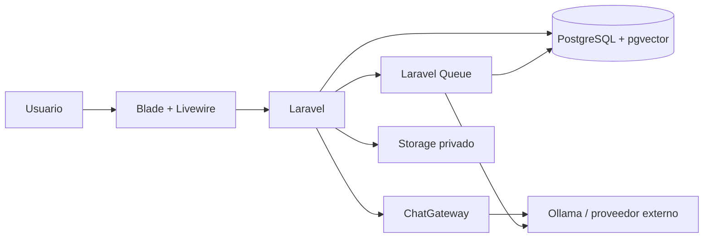

# AI Companion Chatbot

[](https://github.com/Josue-Isai-Sanchez-Santos/ai-companion-chatbot/actions/workflows/ci.yml)

Aplicación web construida con Laravel para conversar con un personaje ficticio persistente que mantiene contexto, memorias semánticas, estado emocional y progreso de relación de forma independiente para cada usuario.

## Estado

**Versión 1.0 funcional.**

La versión 1.0 incluye autenticación, conversaciones persistentes, streaming, memoria semántica, resúmenes, progreso de relación, expresiones, regeneración de respuestas, restablecimiento completo, autorización por usuario, almacenamiento privado de assets, pruebas automatizadas e integración continua.

La generación real de imágenes, audio y video permanece fuera del alcance de esta versión.

## Funciones principales

- Registro e inicio de sesión.
- Personaje base compartido e inmutable desde la experiencia normal del usuario.
- Perfil independiente del personaje para cada usuario.
- Personalidad, forma de hablar y escenario personalizados.
- Conversaciones persistentes.
- Mensajes con historial y ramas.
- Respuestas normales y por streaming.
- Regeneración de respuestas sin destruir la alternativa anterior.
- Memorias persistentes.
- Embeddings almacenados mediante pgvector.
- Recuperación semántica de memorias.
- Resúmenes automáticos de conversaciones largas.
- Estado de relación con métricas de confianza, afecto, familiaridad y tensión.
- Estado emocional y selección de expresión.
- Administrador de memorias.
- Restablecimiento completo del personaje.
- Auditoría mínima de restablecimientos.
- Registro seguro de assets generados.
- Aislamiento y autorización por usuario.
- Rate limiting.
- Validación de entrada y salida.
- Soporte para proveedor externo o modelo local.
- Suite automatizada de pruebas.
- GitHub Actions.

## Tecnologías

- PHP 8.5
- Laravel 13
- Laravel AI
- Laravel Fortify
- Blade
- Livewire 4
- Flux
- PostgreSQL 18
- pgvector 0.8.5
- Docker Compose
- Laravel Queue
- Vite 8
- Node.js 24
- PHPUnit 12
- Laravel Pint

## Arquitectura general



La aplicación es un monolito modular. El proveedor de inteligencia artificial no consulta directamente la base de datos. Laravel prepara el contexto, aplica autorización, recupera memorias y construye los prompts antes de llamar al proveedor.

La arquitectura completa está documentada en [`docs/architecture.md`](docs/architecture.md).

## Requisitos

Para desarrollo local se recomienda disponer de:

- Git.
- PHP 8.3 o superior.
- Composer 2.
- Node.js 24.
- npm.
- Docker.
- Docker Compose.

PHP debe disponer, entre otras, de las extensiones utilizadas por Laravel y PostgreSQL:

- `mbstring`
- `intl`
- `pdo_pgsql`
- `pgsql`

Ollama solo es necesario cuando se utilice el proveedor local.

## Instalación

Clonar el repositorio:

```
git clone https://github.com/Josue-Isai-Sanchez-Santos/ai-companion-chatbot.git
cd ai-companion-chatbot
```

Crear el archivo de entorno:

```
cp .env.example .env
```

Instalar dependencias PHP:

```
composer install
```

Instalar dependencias frontend:

```
npm ci
```

Generar la clave de Laravel:

```
php artisan key:generate
```

## Levantar PostgreSQL y pgvector

El repositorio incluye `compose.yaml` con PostgreSQL 18 y pgvector.

```
docker compose up -d db
```

Verificar el contenedor:

```
docker compose ps
```

Por defecto PostgreSQL queda disponible en:

```
Host:     127.0.0.1
Puerto:   5433
Base:     ai_companion
Usuario:  ai_companion
```

Los valores utilizados por Laravel y Docker deben mantenerse consistentes en `.env`.

## Migraciones y datos iniciales

Ejecutar:

```
php artisan migrate --seed
```

Las migraciones:

- crean las tablas de la aplicación;
- habilitan pgvector;
- crean la columna vectorial de memorias;
- configuran restricciones e índices;
- preparan tablas de colas y caché.

El seeder crea el personaje base `default-companion` y sus expresiones iniciales.

## Compilar frontend

Para una compilación de producción:

```
npm run build
```

Durante desarrollo:

```
npm run dev
```

## Ejecutar la aplicación

Servidor Laravel:

```
php artisan serve
```

La dirección predeterminada será:

```
http://127.0.0.1:8000
```

En otra terminal puede ejecutarse el worker:

```
php artisan queue:work \
    --queue=relationship,summary,memory,default \
    --tries=3 \
    --timeout=240
```

El worker procesa tareas secundarias como:

- extracción de memorias;
- actualización de resúmenes;
- análisis de relación.

## Crear una cuenta y probar el chat

Abrir:

```
http://127.0.0.1:8000/register
```

Después de registrarse, Laravel redirige al chat.

Rutas principales:

```
/chat
/memories
```

La primera visita crea automáticamente el perfil correspondiente al personaje activo.

## Modo simulado

Para probar persistencia e interfaz sin utilizar ningún modelo real:

```
AI_CHAT_DRIVER=simulated
AI_EMBEDDING_DRIVER=simulated

MEMORY_EXTRACTION_ENABLED=false
CONVERSATION_SUMMARY_ENABLED=false
RELATIONSHIP_ANALYSIS_ENABLED=false
```

Este modo es utilizado por la suite automatizada.

## Uso con Ollama

La configuración predeterminada de `.env.example` utiliza Ollama.

Modelos utilizados durante el desarrollo de v1.0:

```
ollama pull qwen3:4b-instruct
ollama pull qwen3-embedding:4b
```

Configuración:

```
AI_CHAT_DRIVER=laravel
AI_CHAT_PROVIDER=ollama
AI_CHAT_MODEL=qwen3:4b-instruct

AI_EMBEDDING_DRIVER=laravel
AI_EMBEDDING_PROVIDER=ollama
AI_EMBEDDING_MODEL=qwen3-embedding:4b
AI_EMBEDDING_DIMENSIONS=1536

OLLAMA_API_KEY=
OLLAMA_URL=http://127.0.0.1:11434

MEMORY_EXTRACTION_PROVIDER=ollama
MEMORY_EXTRACTION_MODEL=qwen3:4b-instruct

CONVERSATION_SUMMARY_PROVIDER=ollama
CONVERSATION_SUMMARY_MODEL=qwen3:4b-instruct

RELATIONSHIP_ANALYSIS_PROVIDER=ollama
RELATIONSHIP_ANALYSIS_MODEL=qwen3:4b-instruct
```

## Uso con OpenAI

El sistema también puede utilizar un proveedor externo mediante Laravel AI.

Ejemplo:

```
AI_CHAT_DRIVER=laravel
AI_CHAT_PROVIDER=openai
AI_CHAT_MODEL=<chat-model>

AI_EMBEDDING_DRIVER=laravel
AI_EMBEDDING_PROVIDER=openai
AI_EMBEDDING_MODEL=text-embedding-3-small
AI_EMBEDDING_DIMENSIONS=1536

OPENAI_API_KEY=<your-api-key>
OPENAI_URL=https://api.openai.com/v1
OPENAI_STORE=false

MEMORY_EXTRACTION_PROVIDER=openai
MEMORY_EXTRACTION_MODEL=<chat-model>

CONVERSATION_SUMMARY_PROVIDER=openai
CONVERSATION_SUMMARY_MODEL=<chat-model>

RELATIONSHIP_ANALYSIS_PROVIDER=openai
RELATIONSHIP_ANALYSIS_MODEL=<chat-model>
```

La clave real debe existir únicamente en `.env`.

Nunca debe añadirse a Git.

## Variables principales

### Chat

| Variable                     | Propósito                                |
| ---------------------------- | ---------------------------------------- |
| `CHAT_RECENT_MESSAGE_LIMIT`  | Mensajes recientes incluidos en contexto |
| `CHAT_MESSAGE_MAX_LENGTH`    | Longitud máxima de entrada               |
| `CHAT_RESPONSE_MAX_LENGTH`   | Longitud máxima de respuesta             |
| `CHAT_GENERATION_RATE_LIMIT` | Límite de generaciones por minuto        |
| `CHAT_RESET_RATE_LIMIT`      | Límite de resets por hora                |
| `CHAT_RESET_CONFIRMATION`    | Palabra necesaria para confirmar reset   |
| `CHAT_STREAMING`             | Habilita streaming                       |

### Memoria

| Variable                    | Propósito                       |
| --------------------------- | ------------------------------- |
| `MEMORY_ENABLED`            | Habilita recuperación semántica |
| `MEMORY_RETRIEVAL_LIMIT`    | Máximo de memorias recuperadas  |
| `MEMORY_MINIMUM_SIMILARITY` | Similitud mínima                |
| `MEMORY_MINIMUM_IMPORTANCE` | Importancia mínima              |
| `MEMORY_EXTRACTION_ENABLED` | Habilita extracción automática  |
| `MEMORY_EXTRACTION_QUEUE`   | Cola de extracción              |

### Inteligencia artificial

| Variable                  | Propósito                       |
| ------------------------- | ------------------------------- |
| `AI_CHAT_DRIVER`          | Implementación de `ChatGateway` |
| `AI_CHAT_PROVIDER`        | Proveedor de conversación       |
| `AI_CHAT_MODEL`           | Modelo de conversación          |
| `AI_EMBEDDING_DRIVER`     | Implementación de embeddings    |
| `AI_EMBEDDING_PROVIDER`   | Proveedor de embeddings         |
| `AI_EMBEDDING_MODEL`      | Modelo de embeddings            |
| `AI_EMBEDDING_DIMENSIONS` | Dimensiones del vector          |

## Pruebas

Ejecutar:

```
php artisan test
```

La suite cubre, entre otros:

- autenticación;
- perfiles;
- conversaciones;
- mensajes;
- streaming;
- proveedor falso;
- memoria;
- recuperación semántica;
- resúmenes;
- relación;
- expresiones;
- regeneración;
- reset;
- autorización;
- assets;
- cascadas de base de datos.

Las pruebas utilizan drivers simulados y no requieren claves reales.

## Integración continua

GitHub Actions ejecuta automáticamente:

```
Composer validation
Composer install
npm ci
Pint para PHP modificado
npm run build
migrate:fresh
php artisan test
```

La base utilizada por CI es PostgreSQL con pgvector.

## Capturas de pantalla

### Chat


### Gestor de memorias


### Restablecimiento completo


## Documentación técnica

- [Arquitectura](docs/architecture.md)
- [Diseño de base de datos](docs/database-design.md)
- [Sistema de memoria](docs/memory-system.md)
- [Contrato de prompts](docs/prompt-contract.md)
- [Contrato de restablecimiento](docs/reset-contract.md)
- [Hoja de ruta](docs/roadmap.md)
- [Modelo de amenazas](docs/threat-model.md)

## Limitaciones conocidas

La versión 1.0 tiene deliberadamente varias limitaciones:

- La interfaz trabaja con un único personaje activo.
- El personaje incluido por defecto es un personaje de desarrollo.
- No existe generación de imágenes, audio o video.
- `generated_assets` prepara el registro y almacenamiento seguro, pero no implementa generación multimedia.
- No existe todavía un endpoint público para servir assets privados.
- El sistema de embeddings utiliza actualmente vectores de 1536 dimensiones.
- Las funciones de memoria, resumen y relación requieren un worker cuando utilizan colas.
- La resistencia a prompt injection es defensa en profundidad y no una garantía absoluta.
- Un fallo del filesystem posterior al commit de un reset no puede revertir la transacción ya confirmada.
- El consumo, disponibilidad y coste de proveedores externos dependen del proveedor utilizado.

## Seguridad

El proyecto implementa:

- autenticación;
- policies de autorización;
- aislamiento por usuario;
- CSRF;
- validación de entradas;
- validación de salidas;
- rate limiting;
- almacenamiento privado de assets;
- rutas generadas internamente;
- protección de secretos mediante variables de entorno;
- cascadas y transacciones para eliminación de datos.

Consultar [`docs/threat-model.md`](docs/threat-model.md) para detalles y riesgos residuales.

## Licencia

Este proyecto se distribuye bajo licencia MIT.
