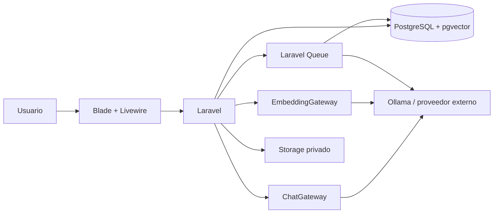
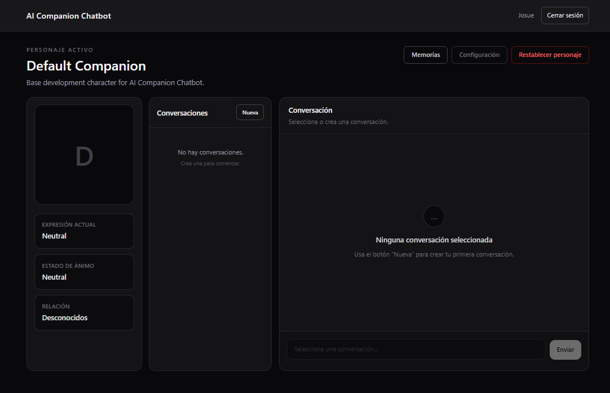
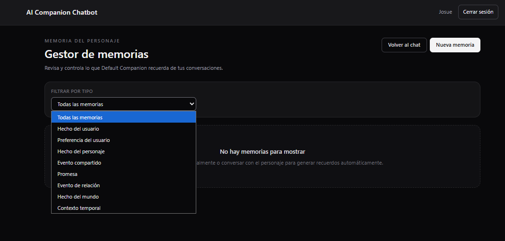
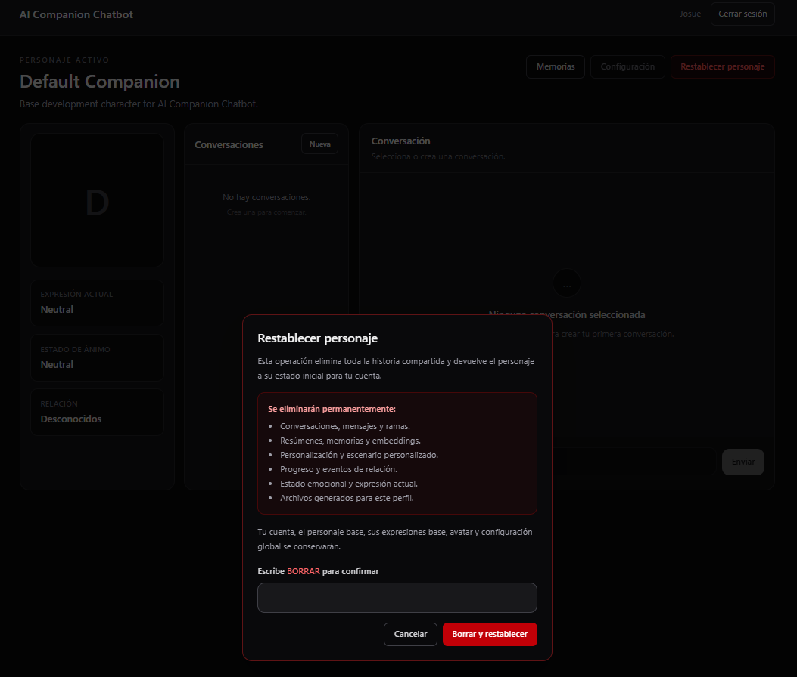

# AI Companion Chatbot

[](https://github.com/Josue-Isai-Sanchez-Santos/ai-companion-chatbot/actions/workflows/ci.yml)

Aplicación web construida con Laravel para conversar con un personaje ficticio persistente que mantiene contexto, memorias semánticas, estado emocional y progreso de relación de forma independiente para cada usuario.

## Estado

**Versión 1.0 funcional.**

La versión 1.0 incluye autenticación, personaje base, perfil independiente por usuario, conversaciones persistentes, streaming, regeneración con ramas, memoria semántica con pgvector, extracción automática de memorias, resúmenes, progreso de relación, estado emocional, restablecimiento completo, almacenamiento privado para assets, autorización, seguridad, pruebas automatizadas e integración continua.

La generación real de imágenes, audio y video permanece fuera del alcance de la versión 1.0.

## Objetivo del proyecto

El proyecto demuestra cómo construir un chatbot persistente sin delegar toda la lógica de la aplicación al modelo de inteligencia artificial.

El sistema separa:

- identidad base del personaje;
- personalización específica del usuario;
- historial conversacional;
- resúmenes;
- memoria semántica;
- estado de relación;
- estado emocional;
- acceso al proveedor de IA.

El proveedor de IA no consulta directamente la base de datos. Laravel selecciona, autoriza y prepara el contexto antes de realizar cada solicitud.

## Tecnologías

- PHP 8.5
- Laravel 13
- Laravel AI
- Laravel Fortify
- Blade
- Livewire 4
- Flux
- PostgreSQL 18
- pgvector 0.8.5
- Docker Compose
- Laravel Queue
- Vite 8
- Node.js 24
- npm
- PHPUnit 12
- Laravel Pint

## Arquitectura general



La arquitectura completa se describe en [`docs/architecture.md`](docs/architecture.md).

## Funciones principales

### Autenticación

La aplicación permite registro, inicio de sesión y cierre de sesión. Las rutas de chat, memoria y reset están protegidas mediante autenticación.

### Personaje base

La definición base incluye:

- nombre;
- descripción;
- personalidad;
- historia;
- forma de hablar;
- escenario;
- reglas internas;
- mensaje inicial;
- expresiones.

El personaje base no se modifica como consecuencia de las conversaciones.

### Perfil por usuario

Cada combinación usuario-personaje tiene un `UserCharacterProfile` con:

- personalidad personalizada;
- forma de hablar personalizada;
- escenario personalizado;
- apodos;
- mood actual;
- expresión actual;
- etapa de relación;
- confianza;
- afecto;
- familiaridad;
- tensión;
- última interacción.

### Conversaciones y mensajes

Cada perfil puede tener múltiples conversaciones. Los mensajes conservan historial, cadena padre-hijo, estado y selección de rama activa.

Estados de mensaje:

- `streaming`;
- `completed`;
- `failed`;
- `interrupted`.

### Streaming

La generación por streaming utiliza un mensaje de asistente temporal con estado `streaming`. Cuando la generación finaliza correctamente pasa a `completed`. Los reintentos reutilizan el mensaje correspondiente cuando procede.

### Regeneración

La última respuesta activa del asistente puede regenerarse. La respuesta anterior no se sobrescribe: se conserva como rama inactiva y la nueva respuesta pasa a ser la rama activa.

### Memoria semántica

Las memorias se almacenan en PostgreSQL y pueden incluir embeddings de 1536 dimensiones. La recuperación considera similitud, importancia, confianza, disponibilidad, deduplicación y límite de resultados.

### Resúmenes

Las conversaciones largas pueden generar un resumen persistente. Cuando existe un resumen se incluye en el prompt y se reduce el número de mensajes recientes necesarios.

### Relación

El sistema mantiene:

- confianza;
- afecto;
- familiaridad;
- tensión.

Etapas:

1. `strangers`
2. `acquaintances`
3. `friends`
4. `close_friends`
5. `romantic_interest`
6. `partners`

La IA propone cambios, pero el backend limita y aplica los valores.

### Estado emocional

Moods definidos:

- `neutral`
- `happy`
- `sad`
- `angry`
- `embarrassed`
- `surprised`
- `curious`

### Restablecimiento completo

El reset elimina el estado específico del perfil y crea una relación nueva sin eliminar la cuenta ni modificar el personaje base.

## Requisitos

Para desarrollo local se recomienda:

- Git;
- PHP 8.3 o superior;
- Composer 2;
- Node.js 24;
- npm;
- Docker;
- Docker Compose.

PHP debe disponer, entre otras, de estas extensiones:

- `mbstring`
- `intl`
- `pdo_pgsql`
- `pgsql`

Ollama es opcional y solo es necesario para utilizar modelos locales.

## Instalación desde cero

Clonar el repositorio:

```bash
git clone https://github.com/Josue-Isai-Sanchez-Santos/ai-companion-chatbot.git
cd ai-companion-chatbot
```

Crear el archivo local de entorno:

```bash
cp .env.example .env
```

Instalar dependencias PHP:

```bash
composer install
```

Instalar dependencias frontend:

```bash
npm ci
```

Generar la clave de Laravel:

```bash
php artisan key:generate
```

## PostgreSQL y pgvector

El repositorio incluye `compose.yaml`.

Levantar la base:

```bash
docker compose up -d db
```

Verificar:

```bash
docker compose ps
```

La configuración de ejemplo utiliza:

```text
Host:     127.0.0.1
Puerto:   5433
Base:     ai_companion
Usuario:  ai_companion
```

## Migraciones y datos iniciales

```bash
php artisan migrate --seed
```

Las migraciones crean las tablas, habilitan pgvector y preparan las restricciones e índices. El seeder crea el personaje `default-companion` y sus expresiones base.

## Frontend

Compilar para producción:

```bash
npm run build
```

Modo desarrollo:

```bash
npm run dev
```

## Ejecutar la aplicación

```bash
php artisan serve
```

Dirección predeterminada:

```text
http://127.0.0.1:8000
```

Si el puerto está ocupado:

```bash
php artisan serve --host=127.0.0.1 --port=8001
```

## Ejecutar el worker

Las funciones secundarias de memoria, resumen y relación utilizan Laravel Queue.

```bash
php artisan queue:work \
    --queue=memory,summary,relationship,default \
    --tries=3 \
    --timeout=240
```

## Crear usuario y probar el chat

Abrir:

```text
http://127.0.0.1:8000/register
```

Después acceder a:

```text
/chat
```

Gestor de memorias:

```text
/memories
```

## Modo simulado

Permite probar la aplicación sin utilizar un proveedor real:

```env
AI_CHAT_DRIVER=simulated
AI_EMBEDDING_DRIVER=simulated
MEMORY_EXTRACTION_ENABLED=false
CONVERSATION_SUMMARY_ENABLED=false
RELATIONSHIP_ANALYSIS_ENABLED=false
```

Este modo se usa también en pruebas automatizadas.

## Uso con Ollama

La configuración de ejemplo utiliza Ollama.

Modelos usados durante el desarrollo:

```bash
ollama pull qwen3:4b-instruct
ollama pull qwen3-embedding:4b
```

Variables principales:

```env
AI_CHAT_DRIVER=laravel
AI_CHAT_PROVIDER=ollama
AI_CHAT_MODEL=qwen3:4b-instruct
AI_CHAT_TIMEOUT=120

AI_EMBEDDING_DRIVER=laravel
AI_EMBEDDING_PROVIDER=ollama
AI_EMBEDDING_MODEL=qwen3-embedding:4b
AI_EMBEDDING_DIMENSIONS=1536
AI_EMBEDDING_TIMEOUT=120

OLLAMA_API_KEY=
OLLAMA_URL=http://127.0.0.1:11434

MEMORY_EXTRACTION_PROVIDER=ollama
MEMORY_EXTRACTION_MODEL=qwen3:4b-instruct

CONVERSATION_SUMMARY_PROVIDER=ollama
CONVERSATION_SUMMARY_MODEL=qwen3:4b-instruct

RELATIONSHIP_ANALYSIS_PROVIDER=ollama
RELATIONSHIP_ANALYSIS_MODEL=qwen3:4b-instruct
```

## Uso con proveedor externo

Ejemplo con OpenAI:

```env
AI_CHAT_DRIVER=laravel
AI_CHAT_PROVIDER=openai
AI_CHAT_MODEL=<chat-model>

AI_EMBEDDING_DRIVER=laravel
AI_EMBEDDING_PROVIDER=openai
AI_EMBEDDING_MODEL=text-embedding-3-small
AI_EMBEDDING_DIMENSIONS=1536

OPENAI_API_KEY=<your-api-key>
OPENAI_URL=https://api.openai.com/v1
OPENAI_STORE=false

MEMORY_EXTRACTION_PROVIDER=openai
MEMORY_EXTRACTION_MODEL=<chat-model>

CONVERSATION_SUMMARY_PROVIDER=openai
CONVERSATION_SUMMARY_MODEL=<chat-model>

RELATIONSHIP_ANALYSIS_PROVIDER=openai
RELATIONSHIP_ANALYSIS_MODEL=<chat-model>
```

La clave real debe existir únicamente en `.env` y nunca debe almacenarse en Git.

## Variables de entorno principales

### Base de datos

| Variable | Función |
| --- | --- |
| `DB_CONNECTION` | Driver de Laravel |
| `DB_HOST` | Host PostgreSQL |
| `DB_PORT` | Puerto visto por Laravel |
| `DB_DATABASE` | Base principal |
| `DB_USERNAME` | Usuario |
| `DB_PASSWORD` | Contraseña |
| `POSTGRES_DB` | Base creada por Docker |
| `POSTGRES_USER` | Usuario creado por Docker |
| `POSTGRES_PASSWORD` | Contraseña del contenedor |
| `POSTGRES_PORT` | Puerto publicado en el host |

### Chat

| Variable | Función |
| --- | --- |
| `CHAT_RECENT_MESSAGE_LIMIT` | Mensajes recientes sin resumen |
| `CHAT_MESSAGE_MAX_LENGTH` | Longitud máxima de entrada |
| `CHAT_RESPONSE_MAX_LENGTH` | Longitud máxima de salida |
| `CHAT_GENERATION_RATE_LIMIT` | Generaciones por usuario/minuto |
| `CHAT_RESET_RATE_LIMIT` | Resets por usuario/hora |
| `CHAT_RESET_CONFIRMATION` | Confirmación textual |
| `CHAT_STREAMING` | Habilita streaming |

### Memoria

| Variable | Función |
| --- | --- |
| `MEMORY_ENABLED` | Habilita recuperación semántica |
| `MEMORY_RETRIEVAL_LIMIT` | Máximo de memorias recuperadas |
| `MEMORY_MINIMUM_SIMILARITY` | Similitud mínima |
| `MEMORY_MINIMUM_IMPORTANCE` | Importancia mínima |
| `MEMORY_EXTRACTION_ENABLED` | Habilita extracción automática |
| `MEMORY_EXTRACTION_QUEUE` | Cola |
| `MEMORY_EXTRACTION_MESSAGE_LIMIT` | Mensajes considerados |
| `MEMORY_EXTRACTION_MAX_MEMORIES` | Máximo de candidatos por job |
| `MEMORY_EXTRACTION_MINIMUM_IMPORTANCE` | Importancia mínima |
| `MEMORY_EXTRACTION_MINIMUM_CONFIDENCE` | Confianza mínima |
| `MEMORY_EXTRACTION_DUPLICATE_SIMILARITY` | Umbral de duplicado |

### IA

| Variable | Función |
| --- | --- |
| `AI_CHAT_DRIVER` | Gateway de conversación |
| `AI_CHAT_PROVIDER` | Proveedor |
| `AI_CHAT_MODEL` | Modelo |
| `AI_CHAT_TIMEOUT` | Timeout |
| `AI_EMBEDDING_DRIVER` | Gateway de embeddings |
| `AI_EMBEDDING_PROVIDER` | Proveedor de embeddings |
| `AI_EMBEDDING_MODEL` | Modelo de embeddings |
| `AI_EMBEDDING_DIMENSIONS` | Dimensiones |
| `AI_EMBEDDING_TIMEOUT` | Timeout |

## Pruebas

Preparar una base de pruebas según `.env.testing.example` y ejecutar:

```bash
php artisan test
```

La suite cubre contratos de proveedores, autenticación, conversaciones, mensajes, streaming, memoria, recuperación semántica, resúmenes, relación, expresiones, regeneración, ramas, reset, assets, autorización, seguridad, cascadas y flujo crítico de v1.0.

Las pruebas utilizan drivers simulados y no requieren API keys reales.

## Integración continua

El workflow `.github/workflows/ci.yml` se ejecuta en `push` y `pull_request` hacia `main`.

Comprueba:

1. checkout;
2. PHP;
3. Node.js;
4. `composer validate --strict`;
5. `composer install`;
6. `npm ci`;
7. entorno de pruebas y `APP_KEY`;
8. Pint para PHP modificado;
9. `npm run build`;
10. migraciones;
11. `php artisan test`.

GitHub Actions utiliza PostgreSQL con pgvector y drivers simulados de IA.

## Capturas de pantalla

### Chat



### Gestor de memorias



### Restablecimiento completo



## Documentación técnica

- [Arquitectura](docs/architecture.md)
- [Diseño de base de datos](docs/database-design.md)
- [Sistema de memoria](docs/memory-system.md)
- [Contrato de prompts](docs/prompt-contract.md)
- [Contrato de restablecimiento](docs/reset-contract.md)
- [Hoja de ruta](docs/roadmap.md)
- [Modelo de amenazas](docs/threat-model.md)

## Limitaciones conocidas

- La interfaz de v1.0 trabaja con un personaje activo.
- El personaje incluido por defecto es un personaje de desarrollo.
- No existe generación real de imágenes, audio o video.
- `generated_assets` prepara persistencia y seguridad para multimedia futura.
- No existe un endpoint público de descarga de assets privados.
- Los embeddings tienen actualmente 1536 dimensiones.
- Memoria, resumen y relación dependen del worker cuando sus funciones asíncronas están activas.
- La calidad de memoria, resumen y análisis de relación depende del modelo configurado.
- La resistencia frente a prompt injection es defensa en profundidad, no una garantía absoluta.
- Un error del filesystem después de confirmar un reset no puede revertir la transacción PostgreSQL ya confirmada.
- El coste y disponibilidad de un proveedor externo dependen del proveedor utilizado.

## Seguridad

Entre las medidas implementadas se encuentran autenticación, Policies, aislamiento por propietario, CSRF, validación de entrada y salida, rate limiting, control de mass assignment, almacenamiento privado, rutas generadas internamente, variables de entorno, transacciones, restricciones de base de datos y pruebas de autorización.

Consultar [`docs/threat-model.md`](docs/threat-model.md).

## Licencia

El repositorio no incluye actualmente un archivo `LICENSE`.

Antes de distribuir el proyecto bajo una licencia concreta debe añadirse explícitamente el archivo correspondiente.
