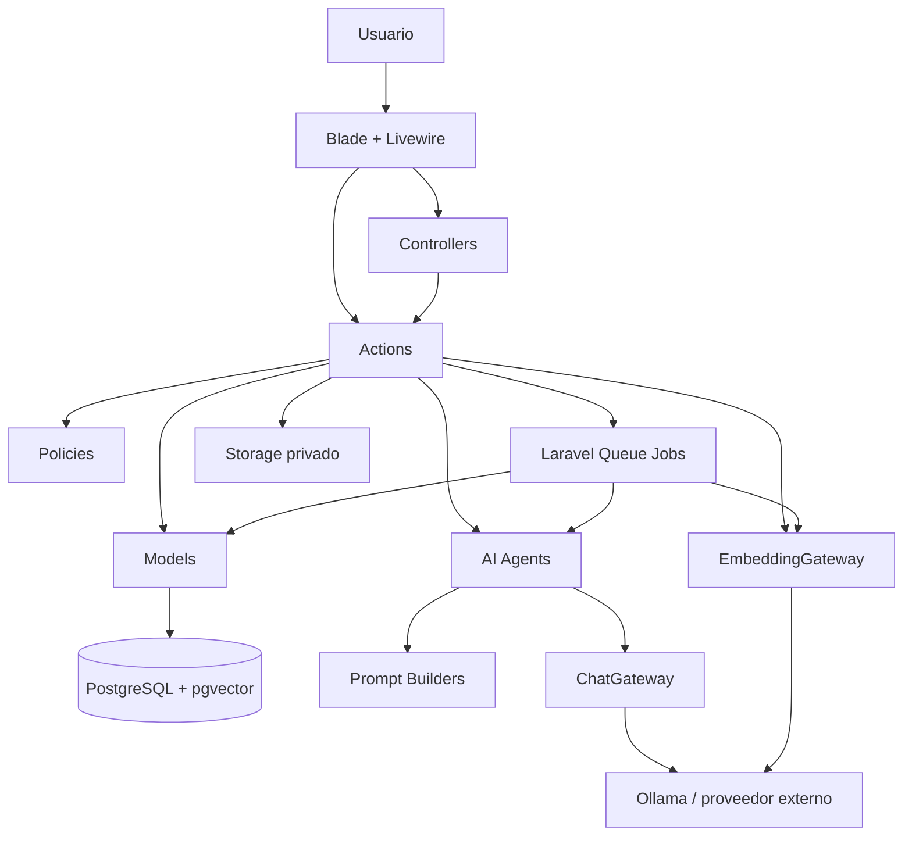
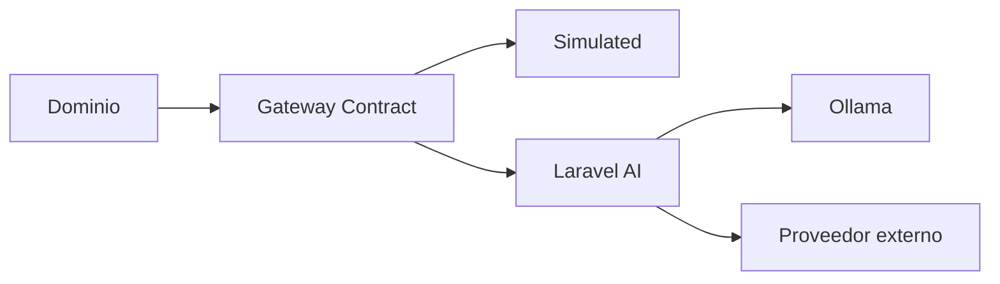
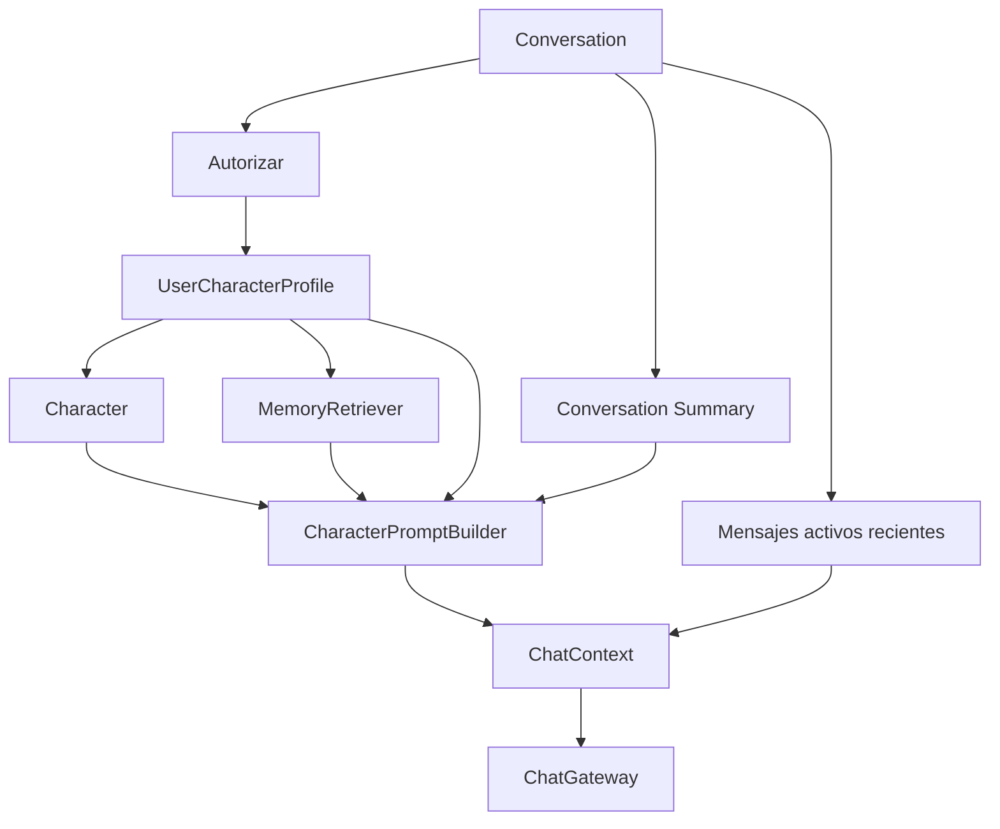
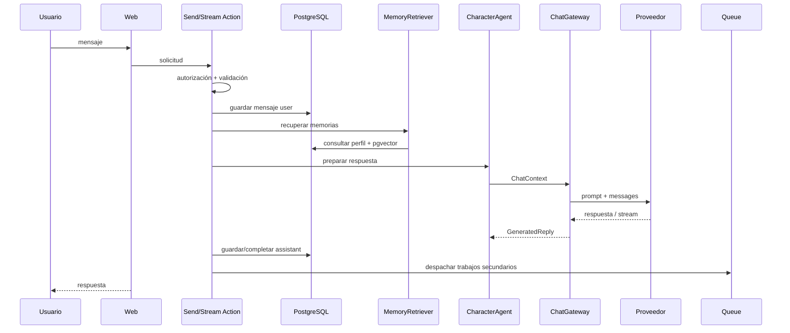
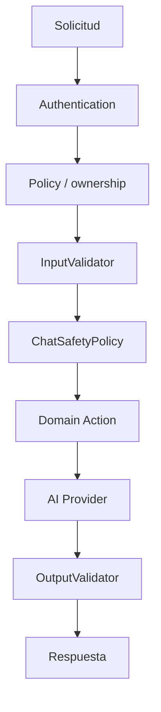

# Arquitectura del sistema

## Estado

**Implementado para la versión 1.0.**

AI Companion Chatbot utiliza un monolito modular basado en Laravel.

La aplicación mantiene una única unidad desplegable, pero separa responsabilidades mediante Models, Actions, Livewire Components, Controllers, Policies, Agents, Prompt Builders, Gateways, Jobs y servicios especializados.

## Objetivos arquitectónicos

La arquitectura busca:

- separar la lógica de dominio de la interfaz;
- impedir que el proveedor de IA consulte directamente la base de datos;
- permitir cambiar de proveedor sin reescribir el dominio;
- mantener aislamiento por usuario;
- reducir el contexto enviado al modelo;
- ejecutar tareas secundarias de forma asíncrona;
- permitir un reset consistente;
- conservar pruebas automatizadas sobre contratos claros.

## Vista general



## Capa de presentación

La interfaz utiliza Blade, Livewire y Flux.

Componentes principales:

- `App\Livewire\Chat\ChatPage`
- `App\Livewire\Chat\MessageList`
- `App\Livewire\MemoryManager`
- `App\Livewire\ResetCharacterModal`

Controladores principales:

- `ResetCharacterController`
- `StreamMessageController`

Rutas principales:

| Método | Ruta | Función |
| --- | --- | --- |
| `GET` | `/` | Página inicial |
| `GET` | `/chat` | Chat |
| `GET` | `/memories` | Gestor de memorias |
| `POST` | `/character/reset` | Restablecimiento |
| `POST` | `/chat/stream` | Streaming |
| `POST` | `/chat/stream/retry` | Reintento de streaming |

Las rutas de chat, memoria, reset y streaming se ejecutan bajo autenticación.

## Dominio

### User

Representa la cuenta autenticada.

### Character

Representa la definición base compartida.

Contiene identidad, personalidad base, backstory, estilo, escenario, reglas, mensaje inicial, avatar y estado activo.

### CharacterExpression

Representa una expresión visual perteneciente a un personaje. Solo una expresión puede ser predeterminada por personaje.

### UserCharacterProfile

Representa el estado particular entre un usuario y un personaje.

Contiene:

- personalización;
- apodos;
- mood;
- expresión;
- relación;
- métricas;
- última interacción.

### Conversation

Agrupa mensajes para un perfil y conserva título, resumen, checkpoint del resumen y fecha del último mensaje.

### Message

Representa un mensaje de conversación.

Incluye:

- conversación;
- mensaje padre;
- rol;
- contenido;
- metadata;
- token count;
- estado;
- selección de rama.

Estados:

- `streaming`
- `completed`
- `failed`
- `interrupted`

Roles:

- `system`
- `user`
- `assistant`

### Memory

Representa conocimiento persistente asociado al perfil y puede almacenar un embedding de 1536 dimensiones.

### RelationshipEvent

Registra un cambio significativo aplicado a la relación.

### GeneratedAsset

Registra metadata de un asset privado asociado al perfil.

### ResetAudit

Conserva una auditoría mínima del restablecimiento.

## Actions

### Personajes

- `CreateUserCharacterProfileAction`
- `ResetCharacterAction`
- `DeleteCharacterAssets`

### Conversaciones

- `CreateConversationAction`
- `RenameConversationAction`
- `DeleteConversationAction`

### Mensajes

- `SendMessageAction`
- `StreamMessageAction`
- `RegenerateMessageAction`
- `DeleteMessageBranchAction`

### Memorias

- `CreateMemoryAction`
- `UpdateMemoryAction`
- `DeleteMemoryAction`

## Policies

Existen:

- `CharacterPolicy`
- `ConversationPolicy`
- `MemoryPolicy`
- `GeneratedAssetPolicy`

Una conversación solo puede utilizarse cuando el perfil al que pertenece corresponde al usuario autenticado. El mismo principio se aplica a memorias y assets.

## Abstracción de IA

La aplicación utiliza dos contratos:

```text
ChatGateway
EmbeddingGateway
```

Implementaciones disponibles:

### Conversación

- `SimulatedChatGateway`
- `LaravelAiGateway`

### Embeddings

- `SimulatedEmbeddingGateway`
- `LaravelAiEmbeddingGateway`



## Construcción del contexto

`CharacterAgent` autoriza la conversación, obtiene perfil y personaje, carga resumen, recupera memorias, selecciona mensajes recientes, construye `CharacterContext`, llama a `CharacterPromptBuilder` y entrega un `ChatContext` al gateway.



`CharacterPromptBuilder` no consulta la base de datos. Recibe información ya preparada y produce un `systemPrompt` determinista.

## Flujo normal de mensaje



## Streaming

El streaming trabaja con un placeholder de asistente:

```text
user message: completed
assistant message: streaming
        ↓
deltas validados
        ↓
assistant message: completed
```

Si falla:

```text
assistant message: failed
```

Si se interrumpe:

```text
assistant message: interrupted
```

Los reintentos reutilizan el mensaje correspondiente cuando la lógica lo permite.

## Procesamiento secundario

Después de una respuesta completada pueden ejecutarse:

- `ExtractConversationMemories`
- `RefreshConversationSummary`
- `UpdateRelationshipState`

Colas predeterminadas:

- `memory`
- `summary`
- `relationship`

Los jobs se despachan después del commit.

## Memoria

La memoria semántica usa `EmbeddingGateway`, PostgreSQL, pgvector, `MemoryRetriever`, `MemoryRanker` y `MemoryDeduplicator`.

El sistema recupera únicamente recuerdos del perfil actual.

## Resúmenes

`RefreshConversationSummary` resume únicamente mensajes activos, completados y de usuario/asistente dentro del checkpoint correspondiente.

Si una regeneración invalida una rama incluida en un resumen, el resumen puede invalidarse para evitar continuidad contaminada.

## Relación

`UpdateRelationshipState` utiliza:

- `RelationshipAnalysisAgent`;
- `RelationshipPromptBuilder`;
- `RelationshipChange`;
- `RelationshipUpdater`;
- `CharacterStateResolver`.

```mermaid
flowchart LR
    TURN[Turn completado]
    ANALYZER[RelationshipAnalysisAgent]
    PROPOSAL[RelationshipChange]
    BACKEND[RelationshipUpdater]
    EVENT[RelationshipEvent]
    STATE[CharacterStateResolver]
    PROFILE[UserCharacterProfile]

    TURN --> ANALYZER
    ANALYZER --> PROPOSAL
    PROPOSAL --> BACKEND
    BACKEND --> EVENT
    EVENT --> STATE
    STATE --> PROFILE
```



La IA propone cambios. El backend limita deltas, limita rangos, decide la etapa, mueve como máximo una etapa por evento y registra valores antes/después.

## Estado emocional

`CharacterStateResolver` interpreta el evento aplicado.

Reglas principales de v1.0:

- aumento fuerte de tensión → `angry`;
- pérdida significativa de confianza o afecto → `sad`;
- reducción fuerte de tensión o aumento significativo de confianza/afecto → `happy`;
- aumento significativo de familiaridad → `curious`;
- ausencia de señal suficiente → `neutral`.

La expresión visual se resuelve mediante `ExpressionResolver`.

## Regeneración y ramas

Una regeneración produce una rama alternativa:

```text
User message
├── Assistant A [inactive]
└── Assistant B [active]
```

Solo los mensajes con `is_active_branch = true` participan en contexto activo y datos derivados.

`DeleteMessageBranchAction` solo permite eliminar ramas inactivas y elimina descendientes, memorias derivadas y eventos derivados.

## Reset

`ResetCharacterAction`:

1. verifica propietario;
2. bloquea el perfil con `lockForUpdate`;
3. cuenta datos para auditoría;
4. elimina el perfil anterior;
5. deja que las FK eliminen dependencias;
6. crea un perfil nuevo;
7. crea una conversación nueva;
8. crea `ResetAudit`;
9. confirma la transacción;
10. elimina assets físicos del perfil anterior.

## Assets

La versión 1.0 prepara la persistencia segura, pero no genera multimedia.

Los archivos asociados deben almacenarse bajo:

```text
storage/app/private/character-assets/profiles/{profile_id}/
```

## Seguridad



## Persistencia

PostgreSQL es la fuente de verdad para cuentas, perfiles, conversaciones, mensajes, memorias, embeddings, relación, auditoría y metadata de assets.

El filesystem privado almacena únicamente bytes de assets.

## Integración continua

GitHub Actions levanta PostgreSQL con pgvector y ejecuta instalación, build, migraciones y pruebas sin requerir secretos de IA reales.

## Límites de v1.0

No se implementan microservicios, generación multimedia, pagos, marketplace, aplicación móvil, fine-tuning ni entrenamiento de modelos.
