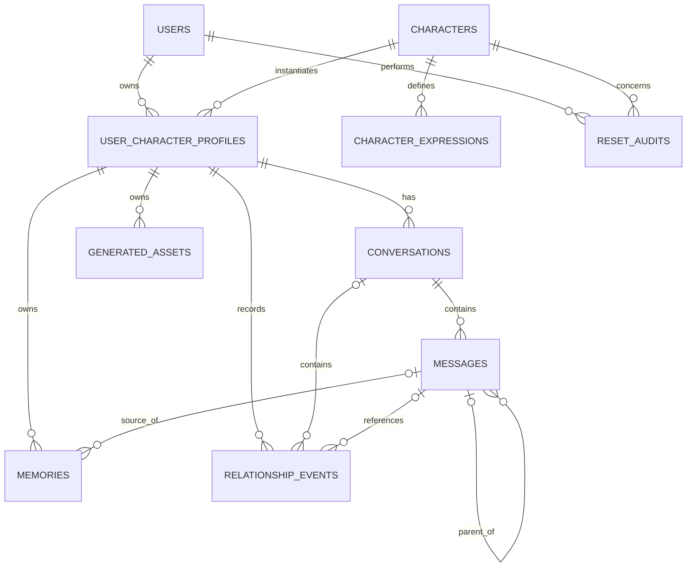
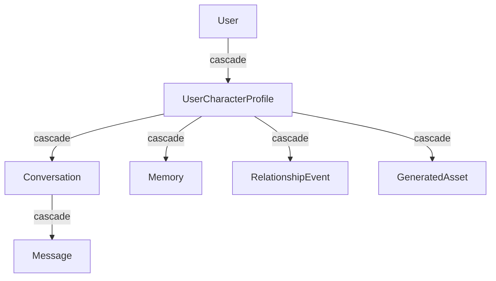

# Diseño de la base de datos

## Estado

**Implementado para la versión 1.0.**

La aplicación utiliza PostgreSQL 18 y pgvector.

## Objetivos del diseño

El esquema busca:

- separar datos globales de datos específicos de usuario;
- mantener integridad mediante foreign keys;
- usar cascadas donde el dominio lo requiere;
- proteger invariantes mediante índices y restricciones;
- permitir reset completo;
- almacenar embeddings de manera nativa;
- conservar auditoría mínima.

## Entidades principales



## Datos globales y datos por usuario

### Datos globales

- `characters`
- `character_expressions`

Estos datos representan la definición base del personaje.

### Datos específicos del usuario

- `user_character_profiles`
- `conversations`
- `messages`
- `memories`
- `relationship_events`
- `generated_assets`

Estos datos pueden desaparecer durante un restablecimiento.

### Auditoría

- `reset_audits`

La auditoría sobrevive al perfil que fue eliminado.

## Tabla `users`

Tabla de autenticación de Laravel.

Campos relevantes:

- `id`
- `name`
- `email`
- `email_verified_at`
- `password`
- `remember_token`
- timestamps

Las migraciones base también crean infraestructura como `password_reset_tokens`, `sessions`, caché, jobs, batches y failed jobs.

## Tabla `characters`

Representa un personaje base.

Campos:

| Campo | Tipo / función |
| --- | --- |
| `id` | PK |
| `name` | nombre |
| `slug` | identificador único |
| `description` | descripción |
| `base_personality` | JSONB |
| `base_backstory` | texto |
| `base_speaking_style` | JSONB |
| `base_scenario` | texto |
| `system_rules` | reglas internas |
| `initial_message` | mensaje inicial |
| `avatar_path` | ruta opcional |
| `is_active` | personaje disponible |
| timestamps | auditoría temporal |

Restricciones:

- `slug` único;
- índice sobre `is_active`.

## Tabla `character_expressions`

Campos:

- `id`
- `character_id`
- `name`
- `description`
- `image_path`
- `is_default`
- timestamps

Restricción:

```text
UNIQUE(character_id, name)
```

Además existe un índice parcial PostgreSQL que permite una sola expresión con `is_default = true` por personaje.

Eliminar un personaje elimina sus expresiones.

## Tabla `user_character_profiles`

Representa la relación individual usuario-personaje.

Campos:

- `id`
- `user_id`
- `character_id`
- `custom_personality`
- `custom_speaking_style`
- `custom_scenario`
- `nickname_for_user`
- `nickname_for_character`
- `current_mood`
- `current_expression_id`
- `relationship_stage`
- `trust`
- `affection`
- `familiarity`
- `tension`
- `last_interaction_at`
- timestamps

Restricción principal:

```text
UNIQUE(user_id, character_id)
```

La expresión actual usa `nullOnDelete`.

Eliminar el usuario o el personaje elimina el perfil.

## Tabla `conversations`

Campos:

- `id`
- `user_character_profile_id`
- `title`
- `summary`
- `summary_updated_at`
- `last_message_at`
- timestamps

Índice:

```text
(user_character_profile_id, updated_at)
```

Eliminar el perfil elimina sus conversaciones.

## Tabla `messages`

Campos:

- `id`
- `conversation_id`
- `parent_message_id`
- `role`
- `content`
- `metadata`
- `token_count`
- `status`
- `is_active_branch`
- timestamps

`is_active_branch` fue añadido posteriormente con valor predeterminado `true`.

Índice de rama activa:

```text
(conversation_id, is_active_branch, created_at, id)
```

Índice cronológico:

```text
(conversation_id, created_at, id)
```

### Roles

- `system`
- `user`
- `assistant`

### Estados

- `streaming`
- `completed`
- `failed`
- `interrupted`

### Parent message

`parent_message_id` permite representar continuidad y alternativas.

La FK usa `nullOnDelete`.

La eliminación completa de una rama se controla desde la capa de dominio para no dejar descendientes accidentales.

## Tabla `memories`

Campos:

| Campo | Función |
| --- | --- |
| `id` | PK |
| `user_character_profile_id` | propietario |
| `source_message_id` | mensaje origen opcional |
| `type` | tipo de memoria |
| `content` | contenido |
| `importance` | 0..1 |
| `confidence` | 0..1 |
| `embedding` | vector(1536), nullable |
| `access_count` | número de recuperaciones |
| `last_accessed_at` | último acceso |
| `expires_at` | expiración opcional |
| timestamps | auditoría |

Restricciones:

```text
importance >= 0 AND importance <= 1
confidence >= 0 AND confidence <= 1
```

Índices:

```text
(user_character_profile_id, type)
(user_character_profile_id, expires_at)
```

La memoria se elimina al eliminar el perfil.

Si se elimina el mensaje fuente, `source_message_id` puede pasar a `NULL`, salvo que la lógica de dominio elimine explícitamente una memoria derivada de una rama eliminada.

## pgvector

La extensión se habilita mediante:

```php
Schema::ensureVectorExtensionExists();
```

La columna actual es:

```text
memories.embedding = vector(1536)
```

Por ello, `AI_EMBEDDING_DIMENSIONS=1536` debe coincidir con el esquema.

Cambiar a un modelo con dimensiones diferentes exige una migración coordinada.

## Tabla `relationship_events`

Registra cambios de relación ya aplicados.

Referencias:

- `user_character_profile_id`
- `conversation_id`
- `user_message_id`
- `assistant_message_id`

Campos descriptivos:

- `event_summary`
- `from_stage`
- `to_stage`

Para cada métrica se conservan:

```text
requested_*_delta
applied_*_delta
*_before
*_after
```

Métricas:

- `trust`
- `affection`
- `familiarity`
- `tension`

`assistant_message_id` es único. Esto implementa idempotencia: un mismo turno del asistente no debe modificar dos veces la relación.

Índice:

```text
(user_character_profile_id, created_at)
```

## Tabla `generated_assets`

Prepara persistencia para multimedia futura.

Campos:

- `id`
- `user_character_profile_id`
- `type`
- `path`
- `mime_type`
- `size_bytes`
- timestamps

Tipos soportados:

- `image`
- `audio`
- `video`
- `other`

La ruta es única.

Formato esperado:

```text
character-assets/profiles/{profile_id}/{ULID}
```

La base de datos aplica un `CHECK` para exigir que la ruta pertenezca al perfil correspondiente y no contenga `..`.

## Tabla `reset_audits`

Campos:

- `id`
- `user_id`
- `character_id`
- `previous_profile_id`
- `new_profile_id`
- `deleted_conversations`
- `deleted_messages`
- `deleted_memories`
- `deleted_relationship_events`
- `reset_at`

Los dos ids de perfil son números históricos, no foreign keys.

Motivo:

- el perfil anterior ya fue eliminado;
- el perfil nuevo puede eliminarse en otro reset.

Índice:

```text
(user_id, character_id, reset_at)
```

## Cascadas principales



El personaje base permanece fuera de esta cascada de estado del usuario.

## Reset y base de datos

El límite destructivo principal es la eliminación del `user_character_profiles` seleccionado.

Las foreign keys eliminan sus dependencias.

Después, dentro de la misma transacción, se crean:

- un nuevo `UserCharacterProfile`;
- una nueva `Conversation`;
- un `ResetAudit`.

## Integridad adicional

La aplicación utiliza PostgreSQL para reforzar:

- unicidad de perfiles;
- unicidad de expresiones;
- una expresión default por personaje;
- rangos de importancia/confianza;
- relaciones entre tablas;
- rutas seguras;
- un evento de relación por respuesta.

## Datos no almacenados

Las API keys no se almacenan en tablas.

Los system prompts construidos en tiempo de ejecución tampoco se persisten en una tabla específica.

## Respaldo

Para respaldar completamente la información persistente de v1.0 deben considerarse:

1. PostgreSQL;
2. `storage/app/private/` si existen assets físicos.

La tabla `generated_assets` contiene metadata, no los bytes del archivo.
