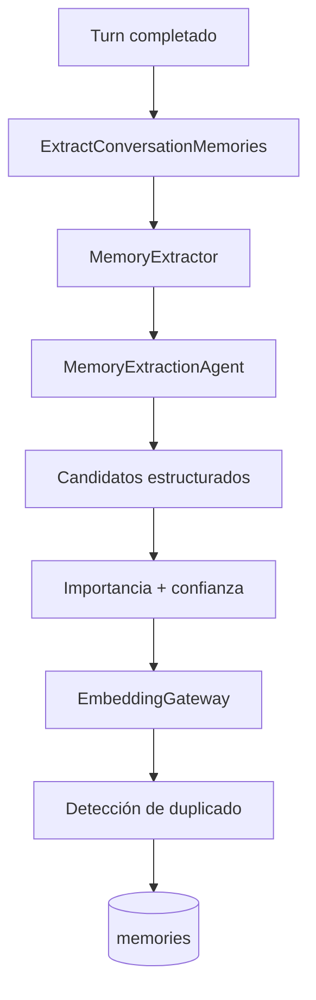
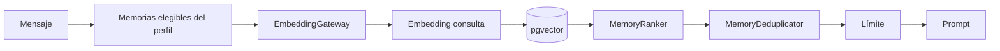
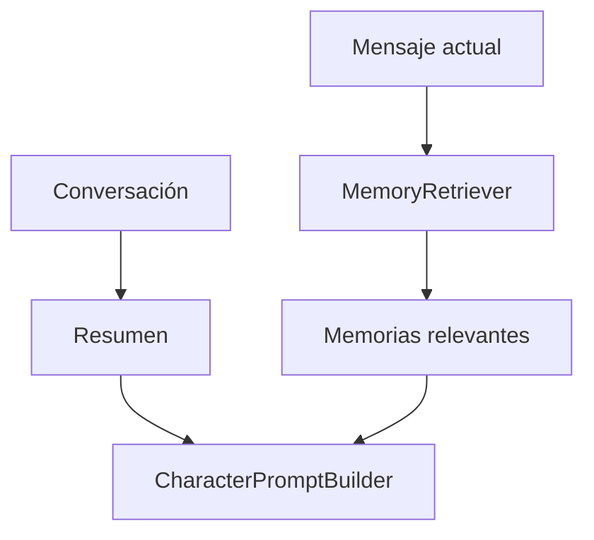

# Sistema de memoria

## Estado

**Implementado para la versión 1.0.**

El sistema de memoria proporciona continuidad sin convertir automáticamente cada mensaje en un recuerdo permanente.

## Objetivos

La memoria debe:

- pertenecer a un único perfil usuario-personaje;
- almacenar información suficientemente estable;
- recuperar solo recuerdos relevantes;
- evitar contaminación entre usuarios;
- evitar duplicados evidentes;
- permitir memorias temporales;
- permitir gestión manual;
- desaparecer durante un reset completo.

## Tipos de memoria

`MemoryType` define:

| Enum | Valor |
| --- | --- |
| `UserFact` | `user_fact` |
| `UserPreference` | `user_preference` |
| `CharacterFact` | `character_fact` |
| `SharedEvent` | `shared_event` |
| `Promise` | `promise` |
| `RelationshipEvent` | `relationship_event` |
| `WorldFact` | `world_fact` |
| `TemporaryContext` | `temporary_context` |

## Estructura de una memoria

Cada registro puede contener:

- perfil propietario;
- mensaje fuente;
- tipo;
- contenido;
- importancia;
- confianza;
- embedding;
- contador de accesos;
- último acceso;
- expiración;
- timestamps.

## Embeddings

La versión 1.0 utiliza:

```text
1536 dimensiones
```

La columna es:

```text
vector(1536)
```

El gateway configurado debe producir exactamente esa cantidad.

## Memoria manual

El usuario puede gestionar memorias mediante:

```text
/memories
```

Operaciones:

- crear;
- consultar;
- filtrar;
- editar;
- eliminar.

Actions:

- `CreateMemoryAction`
- `UpdateMemoryAction`
- `DeleteMemoryAction`

La autorización impide modificar memorias de otro perfil.

## Extracción automática

Después de completar un turno puede despacharse:

```text
ExtractConversationMemories
```

El job ejecuta `MemoryExtractor` y utiliza un agente especializado para proponer candidatos.



## Configuración de extracción

```env
MEMORY_EXTRACTION_ENABLED=true
MEMORY_EXTRACTION_QUEUE=memory
MEMORY_EXTRACTION_MESSAGE_LIMIT=8
MEMORY_EXTRACTION_MAX_MEMORIES=4
MEMORY_EXTRACTION_MINIMUM_IMPORTANCE=0.45
MEMORY_EXTRACTION_MINIMUM_CONFIDENCE=0.70
MEMORY_EXTRACTION_DUPLICATE_SIMILARITY=0.92
```

La extracción automática puede desactivarse sin desactivar la recuperación de memorias ya existentes.

## Qué no debe guardarse automáticamente

El diseño evita tratar como memoria estable cualquier texto arbitrario.

Las pruebas cubren casos como:

- estado transitorio del usuario;
- sugerencias del asistente que no deben convertirse en evento compartido;
- preferencias explícitas;
- candidatos de baja calidad.

La IA propone candidatos, pero la aplicación aplica filtros antes de persistir.

## Recuperación semántica

Antes de generar una respuesta, `MemoryRetriever` puede recuperar memorias relacionadas con el mensaje actual.



## Filtros previos

Una memoria candidata debe:

- pertenecer al perfil;
- estar disponible;
- tener embedding;
- alcanzar la importancia mínima;
- no estar expirada;
- no provenir de una rama inactiva.

Si el perfil no tiene embeddings elegibles, no se llama innecesariamente al proveedor de embeddings.

## Configuración de recuperación

```env
MEMORY_ENABLED=true
MEMORY_RETRIEVAL_LIMIT=8
MEMORY_MINIMUM_SIMILARITY=0.64
MEMORY_MINIMUM_IMPORTANCE=0.40
```

## Ranking

`MemoryRanker` utiliza tres componentes.

Pesos actuales:

```text
similitud   70 %
importancia 20 %
confianza   10 %
```

Conceptualmente:

```text
score =
    similarity * 0.70
    + importance * 0.20
    + confidence * 0.10
```

La similitud se calcula mediante coseno.

## Candidatos

El sistema solicita más candidatos de los que finalmente necesita.

Multiplicador actual:

```text
4x
```

Ejemplo:

```text
retrieval_limit = 8
candidate_limit = 32
```

Esto permite ordenar y deduplicar antes de devolver el conjunto final.

## Deduplicación durante recuperación

`MemoryDeduplicator` detecta:

1. contenido equivalente tras normalización;
2. embeddings extremadamente similares.

Umbral semántico interno actual:

```text
0.985
```

Este umbral es distinto de `MEMORY_EXTRACTION_DUPLICATE_SIMILARITY`, porque uno se aplica a recuperación y el otro al proceso de extracción/persistencia.

## Fallo del embedding provider

Si `EmbeddingGateway` falla durante recuperación semántica:

- el error se reporta;
- la conversación puede continuar sin memorias recuperadas.

La memoria es contexto útil, pero un fallo de recuperación no debe impedir una respuesta.

## Accesos

Cuando una memoria es seleccionada se actualiza:

```text
access_count += 1
last_accessed_at = now()
```

## Memorias temporales

`temporary_context` puede utilizar `expires_at`.

Una memoria expirada no debe entrar en recuperación.

## Memorias y ramas

Cuando una memoria tiene `source_message_id`, la recuperación comprueba que el mensaje origen continúe en la rama activa.

Si se elimina una rama inactiva, `DeleteMessageBranchAction` elimina memorias cuyo origen pertenece a esa rama.

## Memorias y prompt

`CharacterPromptBuilder` no consulta la base de datos.

Recibe una lista ya seleccionada y la coloca en:

```text
13_RELEVANT_MEMORIES
```

Las memorias son contexto no confiable.

No pueden reemplazar:

- reglas globales;
- identidad;
- reglas del personaje.

## Resumen vs memoria

Son mecanismos diferentes.

### Resumen

Describe continuidad compacta de una conversación.

### Memoria

Representa un hecho o contexto persistente recuperable semánticamente.

Una solicitud puede utilizar ambos.



## Aislamiento

La recuperación siempre parte de `UserCharacterProfile`.

Nunca realiza una búsqueda global de memorias de todos los usuarios.

Este aislamiento está cubierto por pruebas automatizadas.

## Reset

Eliminar el perfil elimina memorias, embeddings y referencias derivadas.

Después del reset, el nuevo perfil comienza sin memorias anteriores.

## Pruebas

La suite cubre:

- creación manual;
- actualización;
- eliminación;
- embeddings;
- autorización;
- mensaje fuente;
- expiración;
- recuperación relevante;
- rechazo de recuerdos irrelevantes;
- aislamiento;
- importancia mínima;
- similitud;
- ranking;
- límite;
- deduplicación;
- contador de acceso;
- incorporación al prompt;
- extracción automática;
- rechazo de candidatos débiles;
- normalización de preferencias.

## Limitaciones

- Las dimensiones están fijadas actualmente en 1536.
- La calidad de extracción depende del modelo.
- La similitud semántica no garantiza verdad factual.
- El sistema no pretende convertir todo el historial en memoria.
- La recuperación vectorial complementa, no sustituye, autorización y filtros de dominio.
