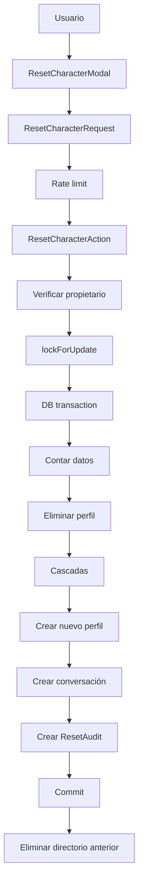

# Contrato de restablecimiento

## Estado

**Implementado para la versión 1.0.**

## Propósito

El restablecimiento completo elimina el estado construido entre un usuario y un personaje y crea una relación nueva utilizando la configuración base del personaje.

El reset no elimina la cuenta.

El reset no modifica el personaje base.

## Endpoint

La operación se expone mediante:

```text
POST /character/reset
```

Requiere autenticación y rate limiting específico.

## Confirmación

La palabra se configura mediante:

```env
CHAT_RESET_CONFIRMATION=BORRAR
```

La comparación es exacta.

El valor predeterminado es:

```text
BORRAR
```

## Precondiciones

Para ejecutar un reset:

- el usuario debe estar autenticado;
- el perfil debe pertenecer al usuario;
- la solicitud debe superar validación;
- la confirmación debe coincidir.

`ResetCharacterAction` vuelve a verificar propiedad aunque exista protección HTTP.

## Flujo completo



## Datos eliminados

Al desaparecer el perfil anterior también desaparece su estado específico:

- personalidad personalizada;
- forma de hablar personalizada;
- escenario personalizado;
- apodos;
- mood;
- expresión actual;
- etapa de relación;
- métricas de relación;
- última interacción.

Las cascadas eliminan:

- conversaciones;
- mensajes;
- ramas;
- resúmenes almacenados en conversaciones;
- memorias;
- embeddings;
- eventos de relación;
- registros de assets.

## Datos conservados

El reset conserva:

- usuario;
- credenciales;
- personaje base;
- personalidad base;
- historia base;
- estilo base;
- escenario base;
- system rules;
- mensaje inicial;
- expresiones base;
- configuración global;
- auditoría del reset.

## Bloqueo

El perfil se obtiene mediante:

```php
lockForUpdate()
```

Objetivos:

- evitar dos resets simultáneos sobre el mismo perfil;
- mantener una operación destructiva consistente.

## Transacción

Dentro de una única transacción se realiza:

1. bloqueo;
2. recuento de datos;
3. eliminación del perfil anterior;
4. cascadas;
5. creación del nuevo perfil;
6. creación de conversación;
7. creación de auditoría.

Si cualquiera de estas operaciones falla antes del commit:

```text
ROLLBACK
```

## Nuevo perfil

El nuevo perfil se crea mediante:

```text
CreateUserCharacterProfileAction
```

Por tanto utiliza los mismos defaults que un perfil nuevo.

Valores iniciales de v1.0:

```text
custom_personality = null
custom_speaking_style = null
custom_scenario = null
nickname_for_user = null
nickname_for_character = null

current_mood = neutral
relationship_stage = strangers

trust = 0
affection = 0
familiarity = 0
tension = 0
```

La expresión actual se obtiene de la expresión predeterminada del personaje.

## Nueva conversación

Después del perfil se crea una nueva conversación mediante:

```text
CreateConversationAction
```

El usuario puede regresar inmediatamente al chat con un contexto limpio.

## Auditoría

`reset_audits` conserva:

- usuario;
- personaje;
- id del perfil anterior;
- id del perfil nuevo;
- conversaciones eliminadas;
- mensajes eliminados;
- memorias eliminadas;
- eventos de relación eliminados;
- fecha.

No guarda:

- contenido de mensajes;
- contenido de memorias;
- prompts;
- claves;
- bytes de archivos.

## Por qué los ids históricos no son foreign keys

`previous_profile_id` no puede apuntar a una fila existente porque esa fila fue eliminada.

`new_profile_id` podría desaparecer posteriormente si el usuario hace otro reset.

Por eso ambos valores son identificadores históricos, no relaciones vivas.

## Assets

Los registros `generated_assets` se eliminan con el perfil.

Los archivos físicos específicos del perfil se almacenan bajo:

```text
storage/app/private/character-assets/profiles/{profile_id}/
```

La eliminación física se realiza únicamente después del commit.

## DB y filesystem no son una sola transacción

Flujo:

```text
PostgreSQL COMMIT
        ↓
eliminar directorio físico
```

Si PostgreSQL falla antes del commit:

```text
DB rollback
archivos conservados
```

Si PostgreSQL confirma pero el filesystem falla:

```text
DB permanece reseteada
assets_deleted = false
error reportado
```

No existe una transacción distribuida entre PostgreSQL y un filesystem normal.

## Jobs obsoletos

Puede existir un job despachado antes del reset.

Los jobs secundarios vuelven a buscar conversación, mensaje o perfil.

Si el recurso desapareció, terminan sin recrearlo.

## Regeneración y reset

Las ramas no necesitan tratamiento especial durante reset.

Eliminar las conversaciones elimina todos sus mensajes, tanto activos como inactivos.

## Seguridad

El reset está protegido por:

- autenticación;
- CSRF;
- Request validation;
- confirmación textual;
- autorización por propietario;
- rate limiting;
- transacción;
- bloqueo pesimista;
- cascadas;
- auditoría.

## Pruebas

La suite cubre:

- recreación del perfil;
- eliminación del estado;
- palabra exacta;
- bloqueo de acceso cruzado;
- rollback;
- preservación de assets ante rollback;
- eliminación física después de commit;
- modal destructivo;
- redirección al nuevo chat;
- estado emocional neutral posterior;
- preservación del personaje base.

## Invariante principal

Después de un reset correcto debe cumplirse:

```text
cuenta original = existe
personaje base = existe
perfil anterior = no existe
estado derivado anterior = no existe
perfil nuevo = existe
conversación nueva = existe
auditoría = existe
```
